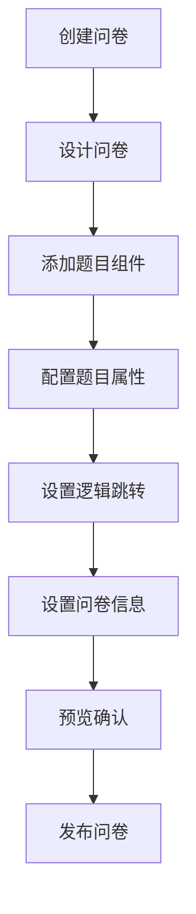
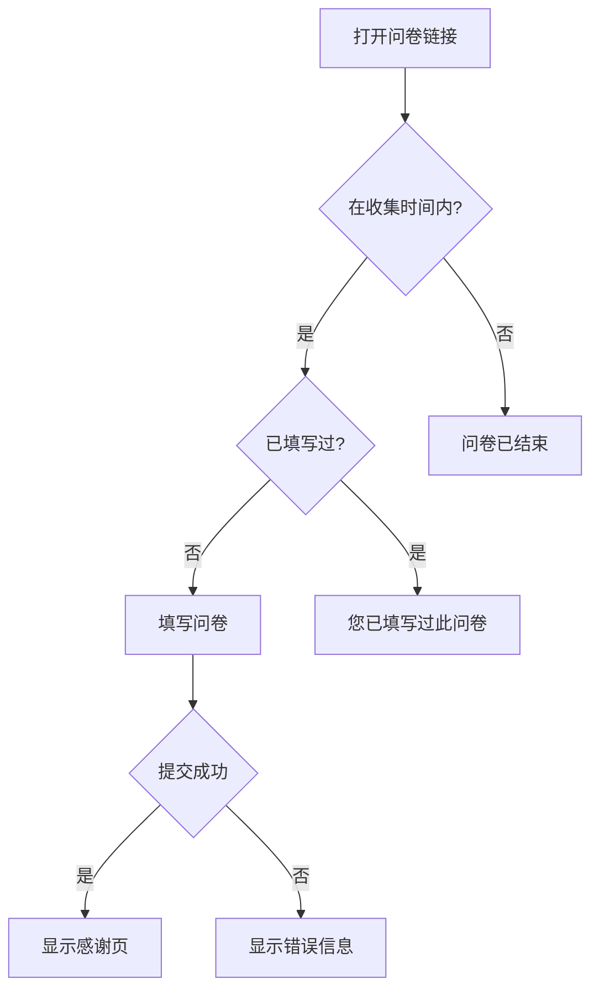
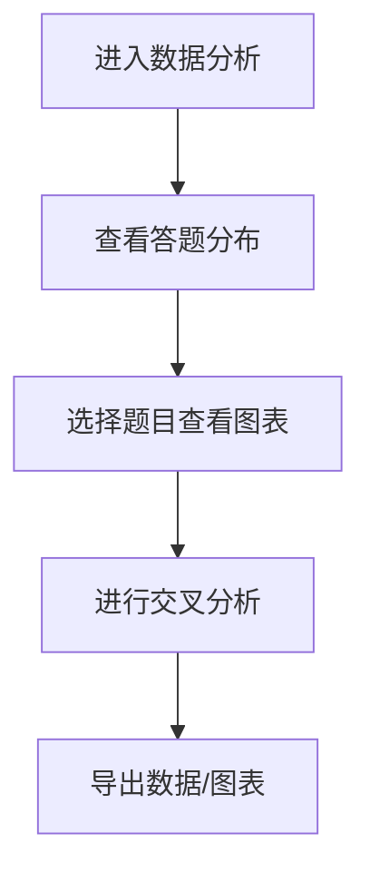

# 问卷星 - 在线调研平台产品需求文档

## 1. 产品概述

一款专业的在线问卷调研平台，帮助用户快速创建、分发和分析问卷调查。

- **核心目的**：简化问卷创建流程，提供直观的拖拽式编辑器，让用户无需编程知识即可创建专业问卷
- **目标用户**：市场调研人员、产品经理、学术研究者、活动组织者等需要进行数据收集的人群
- **市场价值**：降低问卷创建门槛，提高调研效率，支持移动端自适应，满足现代移动办公需求

## 2. 核心功能

### 2.1 用户角色

| 角色 | 说明 | 核心权限 |
|------|------|----------|
| 问卷创建者 | 创建和管理问卷的用户 | 创建、编辑、发布、查看分析、导出数据 |
| 问卷填写者 | 填写问卷的受访者 | 填写、提交问卷 |

### 2.2 功能模块

1. **问卷设计器**
   - 拖拽式问卷编辑器
   - 左侧组件库面板
   - 中间画布区域
   - 右侧属性配置面板

2. **问卷设置**
   - 基础信息配置
   - 收集规则设置
   - 外观自定义

3. **问卷发布**
   - 生成问卷链接
   - 生成二维码
   - 分享功能

4. **问卷填写**
   - 自适应移动端表单
   - 进度条显示
   - 条件逻辑跳转
   - 感谢页展示

5. **数据分析**
   - 答题分布统计
   - 可视化图表
   - 交叉分析
   - 数据导出

### 2.3 页面详情

| 页面名称 | 模块名称 | 功能描述 |
|----------|----------|----------|
| 首页/仪表盘 | 问卷列表 | 展示所有问卷，支持搜索、筛选、创建新问卷 |
| 首页/仪表盘 | 快捷操作 | 创建问卷、导入模板、快速统计入口 |
| 问卷编辑器 | 组件库 | 8种题目类型组件，支持拖拽 |
| 问卷编辑器 | 画布 | 可视化问卷编辑区域 |
| 问卷编辑器 | 属性配置 | 题目设置、选项管理、逻辑跳转 |
| 问卷设置 | 基础设置 | 标题、描述、欢迎语、结束语 |
| 问卷设置 | 收集设置 | 时间范围、限填次数、匿名设置 |
| 问卷预览 | 预览界面 | 模拟填写效果 |
| 问卷填写 | 填写表单 | 移动端自适应、进度条、逻辑跳转 |
| 数据分析 | 统计概览 | 每题答题分布、图表展示 |
| 数据分析 | 交叉分析 | 两题交叉统计表 |
| 数据导出 | 导出选项 | Excel原始数据、图表图片 |

## 3. 核心流程

### 3.1 问卷创建流程

### 3.2 问卷填写流程

### 3.3 数据分析流程

## 4. 用户界面设计

### 4.1 设计风格

- **主题色调**：清新蓝 #409EFF 为主色，渐变辅助 #67C23A 成功色 #E6A23C 警告色
- **按钮风格**：圆角按钮，悬停有阴影效果
- **字体**：思源黑体 / Noto Sans SC，标题 18-24px，正文 14-16px
- **布局风格**：卡片式布局，清晰的视觉层次
- **图标风格**：Element Plus 图标库，线性风格

### 4.2 页面设计概览

| 页面名称 | 模块名称 | 界面元素 |
|----------|----------|----------|
| 仪表盘 | 问卷卡片 | 缩略图、标题、状态标签、创建时间、操作按钮 |
| 问卷编辑器 | 组件库 | 可折叠面板、图标+文字组件、拖拽提示 |
| 问卷编辑器 | 画布 | 虚线边框区域、题目卡片、拖拽指示线 |
| 问卷编辑器 | 属性面板 | Tab切换、表单项、开关、选项列表 |
| 问卷填写 | 表单 | 题目卡片、选项单选/多选、进度条 |
| 数据分析 | 图表区 | 柱状图、饼图、表格、高频词列表 |

### 4.3 响应式设计

- **桌面端**：三栏布局（组件库 + 画布 + 属性面板）
- **平板端**：双栏布局（组件库/属性折叠 + 画布）
- **移动端**：单栏布局，底部导航，表单自适应

## 5. 组件库详细设计

### 5.1 题目类型

| 类型 | 图标 | 描述 | 配置项 |
|------|------|------|--------|
| 单选 | CircleCheck | 单项选择 | 选项列表、随机排列 |
| 多选 | CopyDocument | 多项选择 | 选项列表、最少/最多选择数 |
| 下拉 | ArrowDown | 下拉选择 | 选项列表、占位文本 |
| 评分 | Star | 星级评分 | 星级数量、显示文案 |
| 量表 | Scale | 数字量表 | 最小/最大值、步进、标签 |
| 文本输入 | Edit | 文字回答 | placeholder、多行文本、最大字数 |
| 日期 | Calendar | 日期选择 | 日期格式、范围限制 |
| 矩阵单选 | Grid | 矩阵选择 | 行选项、列选项 |

### 5.2 逻辑跳转规则

- 基于选项的条件跳转
- 跳转到指定题目
- 跳转到结束页

## 6. 数据统计规则

### 6.1 答题分布统计

- **单选题**：显示各选项人数和百分比，柱状图
- **多选题**：显示各选项选择次数和百分比，柱状图
- **填空题**：高频词统计，简化词云
- **评分/量表**：平均值、分布柱状图

### 6.2 交叉分析

- 选择两个题目作为行列
- 显示交叉统计表
- 支持百分比和绝对数量切换
