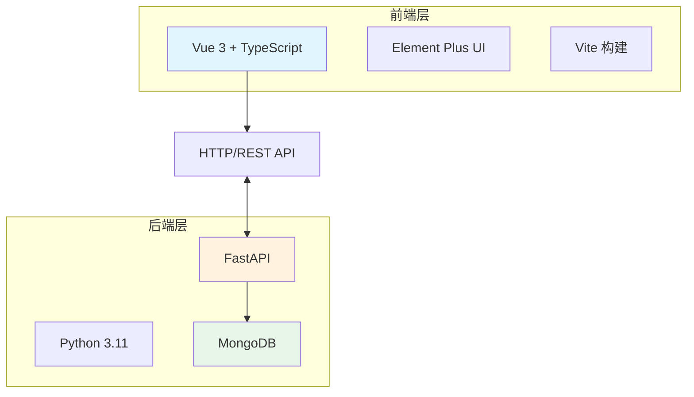
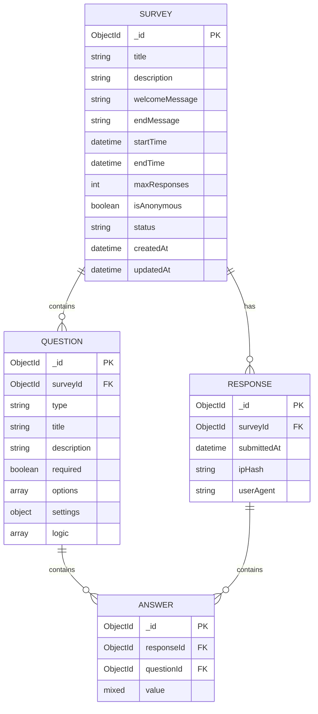

# 问卷星 - 技术架构文档

## 1. 架构设计



## 2. 技术选型

### 2.1 前端技术栈

| 技术 | 版本 | 用途 |
|------|------|------|
| Vue | 3.x | 渐进式前端框架 |
| TypeScript | 5.x | 类型安全 |
| Vite | 5.x | 构建工具 |
| Element Plus | 2.x | UI 组件库 |
| Vue Router | 4.x | 路由管理 |
| Pinia | 2.x | 状态管理 |
| @vueuse/core | latest | 组合式工具库 |
| ECharts | 5.x | 图表库 |
| vuedraggable | 4.x | 拖拽组件 |

### 2.2 后端技术栈

| 技术 | 版本 | 用途 |
|------|------|------|
| Python | 3.11 | 后端语言 |
| FastAPI | 0.109+ | Web 框架 |
| Motor | 3.x | 异步 MongoDB 驱动 |
| pymongo | 4.x | MongoDB 驱动 |
| uvicorn | latest | ASGI 服务器 |
| python-multipart | latest | 文件上传 |

### 2.3 数据库

| 数据库 | 用途 |
|--------|------|
| MongoDB | 问卷结构存储、答卷数据存储 |

## 3. 路由定义

### 3.1 前端路由

| 路由 | 页面 |
|------|------|
| `/` | 首页/仪表盘 |
| `/editor/:id` | 问卷编辑器 |
| `/settings/:id` | 问卷设置 |
| `/preview/:id` | 问卷预览 |
| `/fill/:id` | 问卷填写页 |
| `/analysis/:id` | 数据分析页 |
| `/export/:id` | 数据导出页 |

### 3.2 后端 API

| 方法 | 路由 | 描述 |
|------|------|------|
| GET | `/api/surveys` | 获取问卷列表 |
| POST | `/api/surveys` | 创建问卷 |
| GET | `/api/surveys/:id` | 获取问卷详情 |
| PUT | `/api/surveys/:id` | 更新问卷 |
| DELETE | `/api/surveys/:id` | 删除问卷 |
| POST | `/api/surveys/:id/publish` | 发布问卷 |
| POST | `/api/surveys/:id/close` | 关闭问卷 |
| GET | `/api/surveys/:id/responses` | 获取答卷数据 |
| POST | `/api/surveys/:id/responses` | 提交答卷 |
| GET | `/api/surveys/:id/statistics` | 获取统计数据 |
| POST | `/api/surveys/:id/validate` | 验证填写资格 |

## 4. API 详细定义

### 4.1 问卷数据结构

```typescript
interface Survey {
  _id: string;
  title: string;
  description: string;
  welcomeMessage: string;
  endMessage: string;
  startTime: Date | null;
  endTime: Date | null;
  maxResponses: number | null;
  isAnonymous: boolean;
  status: 'draft' | 'published' | 'closed';
  questions: Question[];
  createdAt: Date;
  updatedAt: Date;
}

interface Question {
  id: string;
  type: QuestionType;
  title: string;
  description?: string;
  required: boolean;
  options?: Option[];
  settings: QuestionSettings;
  logic?: LogicRule[];
}

type QuestionType =
  | 'radio'
  | 'checkbox'
  | 'dropdown'
  | 'rating'
  | 'scale'
  | 'text'
  | 'date'
  | 'matrix';

interface Option {
  id: string;
  text: string;
  jumpTo?: number;
}

interface LogicRule {
  condition: LogicCondition;
  action: 'jump' | 'skip';
  target: number | 'end';
}

interface QuestionSettings {
  placeholder?: string;
  rows?: number;
  maxLength?: number;
  minRating?: number;
  maxRating?: number;
  minValue?: number;
  maxValue?: number;
  step?: number;
  minSelect?: number;
  maxSelect?: number;
  format?: string;
  rows?: string[];
  cols?: string[];
}
```

### 4.2 答卷数据结构

```typescript
interface Response {
  _id: string;
  surveyId: string;
  answers: Answer[];
  submittedAt: Date;
  ipHash?: string;
  userAgent?: string;
}

interface Answer {
  questionId: string;
  value: AnswerValue;
}

type AnswerValue = string | string[] | number | Date;
```

### 4.3 统计数据结构

```typescript
interface Statistics {
  totalResponses: number;
  questionStats: QuestionStatistics[];
}

interface QuestionStatistics {
  questionId: string;
  type: QuestionType;
  distribution: {
    label: string;
    count: number;
    percentage: number;
  }[];
  textAnswers?: string[];
  average?: number;
}
```

## 5. 数据库架构

### 5.1 数据模型



### 5.2 MongoDB 集合

| 集合名 | 说明 |
|--------|------|
| surveys | 问卷主表 |
| responses | 答卷主表 |
| answers | 答案明细表 |

### 5.3 索引设计

```javascript
// surveys 集合索引
{ status: 1 }
{ createdAt: -1 }

// responses 集合索引
{ surveyId: 1, submittedAt: -1 }
{ surveyId: 1, ipHash: 1 } // 用于限填验证

// answers 集合索引
{ responseId: 1 }
{ questionId: 1 }
```

## 6. 项目结构

### 6.1 前端目录

```
frontend/
├── src/
│   ├── assets/          # 静态资源
│   ├── components/     # 公共组件
│   │   ├── common/      # 通用组件
│   │   ├── editor/      # 编辑器组件
│   │   ├── form/        # 表单组件
│   │   └── analysis/    # 分析组件
│   ├── composables/     # 组合式函数
│   ├── layouts/         # 布局组件
│   ├── pages/           # 页面
│   ├── router/         # 路由配置
│   ├── stores/         # 状态管理
│   ├── styles/         # 全局样式
│   ├── types/          # 类型定义
│   ├── utils/          # 工具函数
│   ├── App.vue
│   └── main.ts
├── index.html
├── vite.config.ts
├── tsconfig.json
└── package.json
```

### 6.2 后端目录

```
backend/
├── app/
│   ├── api/            # API 路由
│   │   └── v1/
│   │       ├── surveys.py
│   │       └── responses.py
│   ├── core/           # 核心配置
│   ├── models/         # 数据模型
│   ├── schemas/        # Pydantic 模型
│   ├── services/       # 业务逻辑
│   ├── utils/          # 工具函数
│   └── main.py
├── requirements.txt
└── run.py
```

## 7. 功能详细设计

### 7.1 拖拽编辑器

- 使用 vuedraggable 实现组件拖拽
- 拖拽源：左侧组件库
- 拖拽目标：中间画布
- 支持组件排序和删除

### 7.2 逻辑跳转

- 在选项配置中添加跳转目标选择
- 填写时根据选项动态跳转到指定题目
- 使用状态机管理题目流程

### 7.3 二维码生成

- 使用 qrcode.js 库生成二维码
- 包含问卷链接
- 支持下载和复制

### 7.4 移动端适配

- 使用 rem 单位
- Element Plus 响应式断点
- 表单元素触摸优化

### 7.5 数据可视化

- ECharts 柱状图
- 饼图展示
- 文本高频词统计（词频算法）

## 8. 安全考虑

- IP Hash 存储保护隐私
- 请求频率限制
- 输入验证和消毒
- CORS 配置
